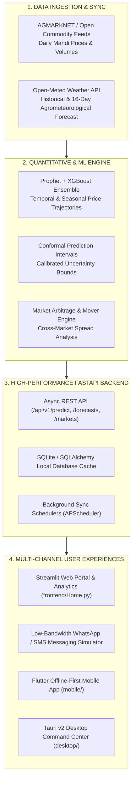

# 🌾 KisanGuard AI: Intelligent Agricultural Forecasting & Decision Support System

[](https://kisanguard-live.vercel.app/)
[](https://vercel.com/new/clone?repository-url=https%3A%2F%2Fgithub.com%2Fshourya2101%2FKisanGuard-AI)
[](https://github.com/shourya2101/KisanGuard-AI)
[](https://fastapi.tiangolo.com/)
[](https://python.org/)
[](https://kisanguard-live.vercel.app/)
[](LICENSE)

> 🚀 **Live Production Deployment**: **[https://kisanguard-live.vercel.app](https://kisanguard-live.vercel.app/)**  
> *Experience the live interactive KisanGuard decision, market price forecasting, and climate intelligence station directly in your browser.*

---

## 🌍 Overview

**KisanGuard AI** is an end-to-end, multi-channel agricultural intelligence platform designed to empower farmers, agricultural cooperatives, and traders with actionable market forecasts and climate insights. 

Agricultural producers often face high price volatility, localized market friction, and unpredictable weather shifts. Compounded by uneven connectivity across rural areas, farmers often lack timely, dependable market data when negotiating at regional mandis. 

KisanGuard AI bridges this gap by combining **machine learning price forecasting**, **hyper-local weather intelligence**, and **multi-channel delivery** (interactive web portal, offline-first mobile app, native desktop command center, and low-bandwidth WhatsApp/SMS simulator).

---

## 🎯 Architecture & Data Flow



---

## ✨ Key Features

1. **ML-Powered Price Forecasting**:
   * Blends **Prophet** (capturing long-term seasonality and cyclical trends) with **XGBoost** (capturing short-term momentum and price lag indicators).
   * Delivers forward-looking price projections up to 90 days with statistical confidence bounds.

2. **Market Intelligence & Arbitrage**:
   * Live tracking of top market gainers, losers, and price movers.
   * Cross-market price comparison to identify profitable regional selling opportunities.

3. **Agrometeorological Weather Integration**:
   * Real-time temperature, precipitation, and soil moisture telemetry via Open-Meteo.
   * Synchronized weather advisories paired directly with crop price volatility indicators.

4. **Multi-Channel Accessibility**:
   * **Web Portal**: Interactive analytics, heatmaps, and trend charts built with Streamlit.
   * **Messaging Simulator**: Demonstrates how rural producers can query prices via low-bandwidth WhatsApp/SMS without broadband access.
   * **Mobile Client**: Offline-first Flutter client with SQLite local caching.
   * **Desktop Station**: Lightweight native Tauri v2 desktop application for regional agricultural hubs.

---

## 📂 Repository Structure

```
AgriGuard/
├── backend/                  # FastAPI Application
│   └── app/
│       ├── core/             # Configuration & environment settings
│       ├── routers/          # Forecast, market, weather, and messaging routers
│       ├── services/         # Data sync services (weather, commodity feeds)
│       ├── schemas/          # Pydantic request/response schemas
│       ├── database.py       # SQLAlchemy ORM setup
│       ├── model.py          # ML model loader and inference pipeline
│       └── main.py           # FastAPI entrypoint
├── frontend/                 # Streamlit Web Application
│   ├── Home.py               # Landing page and system status
│   ├── style.py              # Unified KisanGuard brand styling
│   ├── pages/
│   │   ├── dashboard.py      # Core market intelligence & analytics dashboard
│   │   ├── price_forecast.py # Multi-horizon crop price forecast
│   │   └── ussd_simulator.py # WhatsApp & SMS mobile simulator
│   └── package.json
├── mobile/                   # Flutter Offline-First Mobile App
│   ├── lib/                  # Dart application code
│   └── pubspec.yaml          # Flutter configuration
├── desktop/                  # Tauri v2 Desktop Command Center
│   ├── src/                  # React dashboard
│   ├── src-tauri/            # Tauri Rust backend configuration
│   └── package.json
├── ml/                       # Machine Learning models and artifacts
│   └── models/               # Serialized pipelines (.pkl)
├── data/                     # Raw and processed datasets
│   └── raw/                  # Commodity and weather data
├── scripts/                  # Data downloads and model training scripts
│   ├── download_agmarknet_data.py
│   ├── train_models.py
│   └── validate_data.py
├── docker-compose.yml        # Multi-container orchestration
├── Dockerfile                # Production container definition
├── run.sh                    # Native execution launcher
└── pyproject.toml            # Python packaging and dependencies
```

---

## 🌐 Live Cloud Deployment (Vercel)

The KisanGuard AI interactive web portal is deployed live on Vercel:

* **Live Demo URL:** **[https://kisanguard-live.vercel.app/](https://kisanguard-live.vercel.app/)**

### 1-Click Deploy to Vercel

[](https://vercel.com/new/clone?repository-url=https%3A%2F%2Fgithub.com%2Fshourya2101%2FKisanGuard-AI)

1. Click the **Deploy with Vercel** button above (or import `shourya2101/KisanGuard-AI` directly in your [Vercel Dashboard](https://vercel.com/new)).
2. Vercel automatically detects the root `package.json` and `vercel.json`.
3. Click **Deploy** — your live cloud portal is built and deployed automatically with zero manual configuration.

---

## 🚀 Quick Start

### 1. Prerequisites
* Python 3.10, 3.11, or 3.12 (Python 3.12 recommended)
* Node.js 18+ (for desktop/client packages)
* Flutter SDK (optional, for mobile build)

### 2. Environment Setup
Copy the environment template and initialize your configuration:
```bash
cp config/.env.example config/.env
```

### 3. Native Execution
Use the automated runner:
```bash
chmod +x run.sh
./run.sh
```

Or run services manually:

**Start FastAPI Backend:**
```bash
uvicorn backend.app.main:app --host 0.0.0.0 --port 8000 --reload
```

**Start Streamlit Web Portal:**
```bash
streamlit run frontend/Home.py --server.port 8501
```

Access the interfaces:
* **Interactive Web Portal**: [http://localhost:8501](http://localhost:8501)
* **Interactive API Documentation (Swagger)**: [http://localhost:8000/docs](http://localhost:8000/docs)

### 4. Docker Compose
Deploy all services in containers:
```bash
docker-compose up --build
```

---

## 📡 API Overview

| Method | Endpoint | Description |
|---|---|---|
| `GET` | `/health` | System and model health check |
| `POST` | `/api/v1/predict` | Single-point crop price prediction with confidence intervals |
| `GET` | `/forecasts/{commodity}` | Multi-horizon forecast for a given crop and market |
| `GET` | `/forecasts/history/{commodity}` | Historical price observations |
| `GET` | `/markets/national-summary` | Overview of commodities across regional mandis |
| `GET` | `/markets/movers` | Daily top gainers and price decliners |
| `GET` | `/weather/{market}` | Agrometeorological readings and 16-day weather forecast |
| `POST` | `/whatsapp/simulate` | Interactive endpoint simulating farmer SMS/WhatsApp queries |

---

## 👥 Authors & Attribution

* **Shourya Pratap** ([singhshourya434@gmail.com](mailto:singhshourya434@gmail.com))
* **ZeroTrace7**

---

## 📄 License

This project is licensed under the GNU Affero General Public License v3.0 ([AGPL-3.0](LICENSE)).  
Commercial licenses are also available for proprietary distributions. See [COMMERCIAL_LICENSE.md](COMMERCIAL_LICENSE.md) for details.
